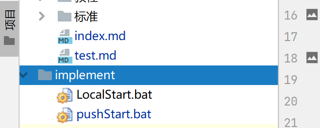

# 本Wiki项目的安装与使用

## 1.wiki安装(mkdocs安装)
_**预先环境：windows 、 Python2.7.8 +**_  
1.以管理员身份打开cmd 输入
```
pip install mkdocs
```
```
pip install mkdocs-material
```
2.安装完成  
## 2.本项目的导入  
1.从GitHub上导入到本地  
gitUrl:`https://github.com/EnlightenRK/teamWiki.git`  

2.如果成功则出现

## 3.配置mkdocs本地和远程项目部署文件
1.找到本项目implement文件夹里面有本地和远程启动文件



2.打开配置管理窗口


3.添加配置


4.找到shell script配置选项


5.脚本路径设置为implement内启动文件


6.配置命名


7.启动测试  
  

8.pushStart远程文件同理


